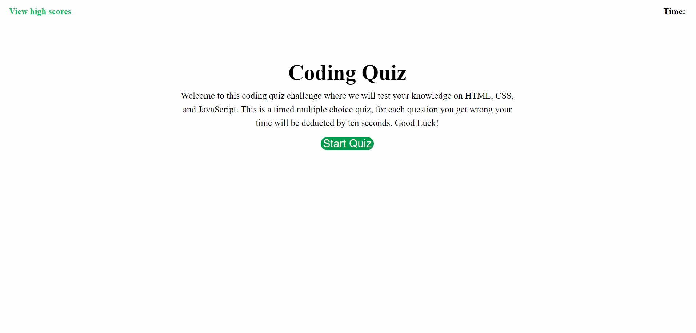

# coding-quiz

## Description

In this coding quiz you will be quized on the topics of HTML, CSS, and JavaScript. Once you have clicked the start quiz button, the timer will start to countdown from 60 seconds. For every question you get right it will display "Correct!" text under the question choices and promt you to the next question. But if you get a quesiton wrong it will display "Wrong!" text and your time will be deducted by ten seconds. Once you have finished all the questions or the timer has run out, you will be prompted to a "Quiz Completed!" screen where it displays your time and you can write your initials. After that you can submit it where it will then show you all the highscores of all the scores. This was all possible by using JavaScript, some major functions used were queryselectors, arrays, setInterval, textContent, for loops, if statements, JSON, and more.

## Deployment

## Usage

## Code Source
